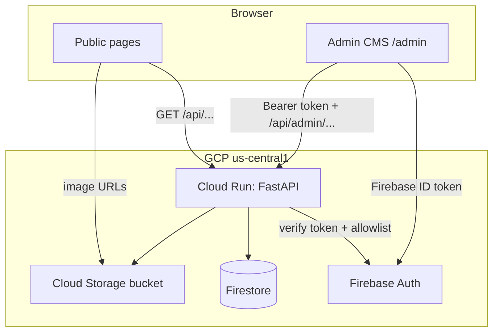

# Architecture Overview

The portfolio is a two-tier application: a static React front end and a single
stateless API service backed by GCP-managed data stores.

## Components

| Component | Technology | Responsibility |
|-----------|------------|----------------|
| Front end | Vite + React + TypeScript | Public site and admin CMS UI |
| API | FastAPI on Cloud Run | Public reads, authenticated writes, media upload URLs |
| Database | Firestore (Native mode) | All structured content |
| Media | Cloud Storage | Images and uploaded assets |
| Auth | Firebase Auth | Admin identity; email allowlist enforced in the API |

## Data flow

- Public pages call unauthenticated `GET /api/*` endpoints. The API returns
  only `published` projects, posts, and demos.
- The CMS authenticates with Firebase Auth, obtains an ID token, and calls
  `/api/admin/*` with a bearer token. The API verifies the token and checks the
  email against `ADMIN_ALLOWED_EMAILS` before allowing any write.

## Connector abstraction

The API depends on the interfaces in
[`backend/app/connectors/base.py`](../../backend/app/connectors/base.py):

- `mock` connectors (in-memory) power local development and the test suite.
- `gcp` connectors (Firestore + Cloud Storage) power production.

Selection is controlled by the `CONNECTOR` environment variable, so the same
route and service code runs unchanged in both environments.

## Caching strategy (hybrid content)

- Semi-static content (profile, education, experience, skills) changes rarely
  and can be cached aggressively by the browser/CDN.
- Dynamic content (projects, posts, demos) is fetched per view.

The public API is safe to cache because it is read-only and returns published
content only.

## Environments

| Environment | Connector | Auth mode |
|-------------|-----------|-----------|
| Local dev / CI | `mock` | `mock` (`dev:<email>` tokens) |
| Production | `gcp` | `firebase` |
