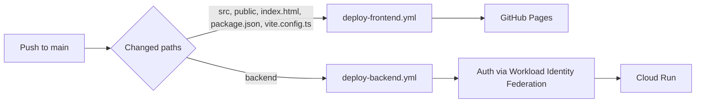

# CI/CD Requirements

Two independent deploy pipelines run from GitHub Actions, each triggered only
when its part of the repo changes.

## Authentication: Workload Identity Federation (no keys)

The backend pipeline authenticates to GCP using Workload Identity Federation, so
there are no long-lived service account JSON keys in GitHub. Terraform creates
the pool, provider, and the binding that lets this repository impersonate the
deploy service account.

## Required GitHub repository secrets

| Secret | Source | Used by |
|--------|--------|---------|
| `GCP_PROJECT_ID` | your project ID | backend |
| `GCP_WORKLOAD_IDENTITY_PROVIDER` | `terraform output workload_identity_provider` | backend |
| `GCP_DEPLOY_SA` | `terraform output deployer_service_account` | backend |
| `VITE_API_URL` | `terraform output api_url` | frontend |
| `VITE_ADMIN_EMAILS` | your allowlist (e.g. `admin@example.com`) | frontend |
| `VITE_FIREBASE_API_KEY` | Firebase web app config | frontend |
| `VITE_FIREBASE_AUTH_DOMAIN` | Firebase web app config | frontend |
| `VITE_FIREBASE_PROJECT_ID` | Firebase web app config | frontend |
| `VITE_FIREBASE_APP_ID` | Firebase web app config | frontend |

`VITE_AUTH_MODE` is set to `firebase` directly in the frontend workflow.

## Required GCP roles (granted by Terraform to the deploy SA)

For Cloud Run deploy:
- `roles/run.admin` — deploy Cloud Run
- `roles/artifactregistry.writer` — push/read images
- `roles/iam.serviceAccountUser` on the runtime SA — set it on the service

For `gcloud builds submit` from CI:
- `roles/cloudbuild.builds.editor` — create builds
- `roles/storage.admin` — upload source to `*_cloudbuild` bucket
- `roles/serviceusage.serviceUsageConsumer` — use project APIs
- `roles/logging.viewer` — optional log access
- `roles/iam.serviceAccountUser` on the default Compute SA
  (`PROJECT_NUMBER-compute@developer.gserviceaccount.com`) and the classic
  Cloud Build SA (`PROJECT_NUMBER@cloudbuild.gserviceaccount.com`)

Also granted to the build runner SAs:
- `roles/artifactregistry.writer` on Compute + Cloud Build SAs — push the image

The backend workflow submits builds with `--async` and polls
`gcloud builds describe` so CI does not fail when it cannot stream the default
logs bucket.

## Path filters

| Pipeline | Trigger paths |
|----------|---------------|
| Frontend | `src/**`, `public/**`, `index.html`, `package.json`, `vite.config.ts`, `.github/workflows/deploy-frontend.yml` |
| Backend | `backend/**`, `.github/workflows/deploy-backend.yml` |
| Terraform | manual (`workflow_dispatch`) only |

A frontend-only change never redeploys the backend, and vice versa.

## Frontend deploy

Builds the Vite app (injecting `VITE_*` at build time) and publishes `dist/` to
GitHub Pages, reusing the existing Pages setup.

## Backend deploy

Authenticates via WIF, builds the image with Cloud Build, pushes to Artifact
Registry, deploys to Cloud Run, then smoke-tests `/health`.

## Terraform pipeline

Manual `workflow_dispatch` with a `plan`/`apply` choice. Infrastructure is never
changed automatically on push.

## Rollback

- Backend: `gcloud run services update-traffic portfolio-api --to-revisions=PREVIOUS=100`
  (Cloud Run keeps prior revisions).
- Frontend: re-run the workflow on a previous commit, or revert the commit.
