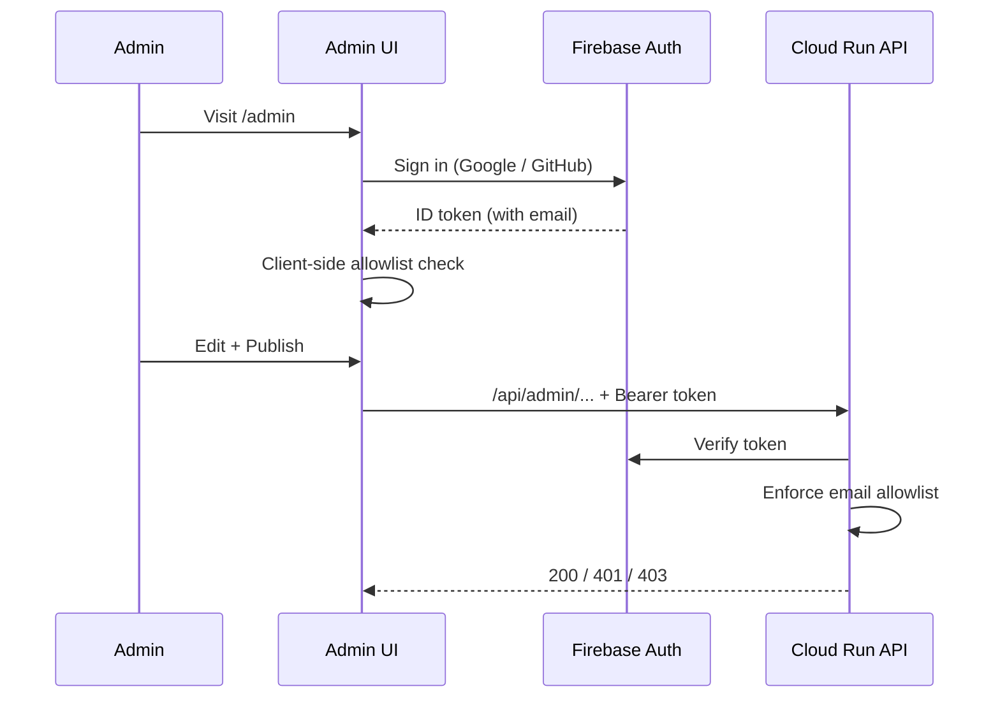

# CMS Overview

The CMS is a private, single-admin content management interface for the
portfolio. It lets the owner write, edit, and publish all site content without
editing code.

## Access model

Access is controlled in two independent layers:

1. Front end ([`ProtectedRoute`](../../src/components/admin/ProtectedRoute.tsx))
   redirects unauthenticated users to `/admin/login` and blocks non-allowlisted
   emails. This is UX only.
2. Back end ([`require_admin`](../../backend/app/auth/firebase.py)) verifies the
   token and enforces the email allowlist on every write. This is the real
   security boundary.

The allowlist is configured by `ADMIN_ALLOWED_EMAILS` (backend) and
`VITE_ADMIN_EMAILS` (front end). Keep them in sync.

## Routes

| Route | Purpose |
|-------|---------|
| `/admin/login` | Sign in |
| `/admin` | Dashboard (counts, quick actions) |
| `/admin/profile` | Profile, bio, social links, profile image |
| `/admin/education` | Education entries |
| `/admin/experience` | Experience entries |
| `/admin/skills` | Skill categories |
| `/admin/projects` | Project list |
| `/admin/projects/new`, `/admin/projects/:id` | Project editor (ML/SWE/Research tabs) |
| `/admin/posts` | Blog post list |
| `/admin/posts/new`, `/admin/posts/:id` | Markdown post editor |
| `/admin/demos` | Demo list |
| `/admin/demos/new`, `/admin/demos/:id` | Demo editor |
| `/admin/media` | Media library |

## Workflows

- Draft/publish: content is created as `draft` and hidden from the public site
  until published. Publishing stamps `published_at`.
- Media upload: the editor requests a signed URL, uploads bytes directly to
  Cloud Storage, and stores the resulting public URL.
- Ordering: education, experience, and skills use a numeric `sort_order`.
- Audit: every write records `updated_by_email` and `updated_at`.

## Auth modes

| Mode | When | Sign-in |
|------|------|---------|
| `mock` | Local dev / tests | Email field mints a `dev:<email>` token |
| `firebase` | Production | Google / GitHub popup |

Mock mode lets you exercise the entire CMS locally without any Firebase setup.
